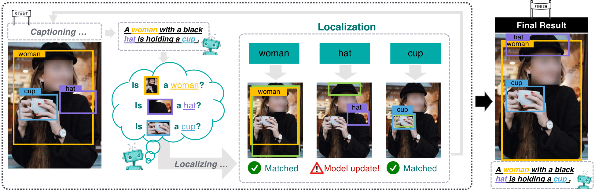

## Learning to Generate Grounded Visual Captions without Localization Supervision
 

This is the PyTorch implementation of our paper:

**Learning to Generate Grounded Visual Captions without Localization Supervision** 
[__***Chih-Yao Ma***__](https://chihyaoma.github.io/), [Yannis Kalantidis](https://www.skamalas.com/), [Ghassan AlRegib](https://ghassanalregib.info/), [Peter Vajda](https://sites.google.com/site/vajdap), 
[Marcus Rohrbach](https://rohrbach.vision/), [Zsolt Kira](https://www.cc.gatech.edu/~zk15/) 

[[arXiv](https://arxiv.org/abs/1906.00283)] [[GitHub](https://github.com/chihyaoma/cyclical-visual-captioning)] [Project (coming soon)]

## Code coming soon! Please stay tuned.
